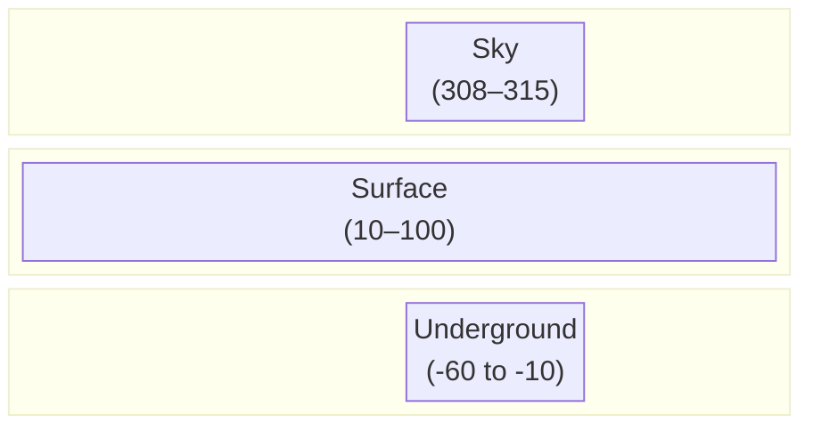
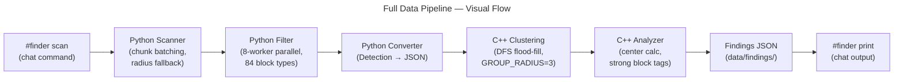

# 🔍 Minecraft Base Finder Engine

> **Real-time base discovery** — Scan, cluster, and locate hidden player structures entirely in-game via a single Minescript chat command.

> 📌 **Note:** Deep technical specifications, clustering algorithms, C++ architecture, and pipeline diagrams can be found in [`docs/ARCHITECTURE.md`](docs/ARCHITECTURE.md).

<p align="center">
  
  
  
  
  
  
</p>

| 🔍 Smart Scanning | ⚡ C++ Clustering | 🛡️ Data Safety | ⚙️ Full Control |
|---|---|---|---|
| 5 Y-level modes (sky → underground) | Flood-fill spatial cluster (r=3) | Auto-retention (last 5 scans) | Radius 4–32 blocks |
| Graceful radius fallback | Strong block tagging (16 types) | Saved findings persist forever | Debug logging toggle |
| 84 interesting block types | Center coordinate computation | Never overwrites your data | Hot-swap via chat command |

> **One chat command. Zero external tools. Full base intelligence.**
> Type `#finder scan default` and get a complete report of every player-built structure within range — without ever leaving the game.

---

## 🎬 Quick Demo


*Coming soon — animated preview of a full scan cycle from chat command to findings output.*

---

## Key Features

- **In-Game Chat Control** — All commands run through `#finder` chat prefix. No external GUIs or switching windows.
- **Five Scan Modes** — `sky`, `surface`, `underground`, `full`, and `default` target specific Y-level bands for precise scans.
- **84 Interesting Block Types** — Covers storage, redstone, lighting, functional blocks, decorative variants, and rare blocks. Everything that matters for base detection.
- **Intelligent Variant Normalization** — Bed colors, wood types, glass tints, shulker box colors, and anvil damage states are collapsed into their base type for clearer output.
- **C++ Clustering Engine** — Flood-fill spatial clustering (26-neighbor, GROUP_RADIUS=3) groups nearby blocks into connected clusters, then computes aggregate findings with center coordinates.
- **Strong Block Classification** — Beacon, enchanting table, ender chest, nether portal, and 12 other high-significance blocks are tagged separately for immediate visibility.
- **Radius Fallback** — If outer chunks fail to load, the scan gracefully shrinks its radius instead of crashing.
- **Automatic Retention** — Last 5 scans kept in rotation. No manual cleanup.
- **Custom Saved Findings** — Name and persist interesting scans for later review.
- **Adjustable Logging** — Toggle debug chat output on or off at runtime.
- **Configurable Radius** — Set search radius from 4 to 32 blocks around the player.

---

## 📌 Requirements

| Component | Version | Notes |
|-----------|---------|-------|
| Minecraft | 1.20+ | Java Edition — works on Fabric, Forge, and NeoForge |
| MineScript | 4.0+ | [Modrinth](https://modrinth.com/mod/minescript) / [CurseForge](https://www.curseforge.com/minecraft/mc-mods/minescript) — install like any other mod |
| Python | 3.11+ | Bundled with MineScript — no separate install needed |
| CMake | 3.12+ | Only required for building the C++ core components |
| C++ Compiler | C++20 | MSVC (Windows), GCC 12+ (Linux), Clang 14+ (macOS) |

> **Minimal setup.** No modpack required. No heavy dependencies. Install Minescript, build the C++ module, and go.

---

## 🛠️ Quick-Start Installation

### Step 1: Install MineScript

Download MineScript 4.0+ from [Modrinth](https://modrinth.com/mod/minescript) or [CurseForge](https://www.curseforge.com/minecraft/mc-mods/minescript) and place it in your Minecraft `mods/` folder. Launch Minecraft once to generate the `minescript/` directory.

### Step 2: Clone and Build

```bash
# Clone the repository
git clone https://github.com/your-username/Minecraft-Base-Finder.git
cd Minecraft-Base-Finder

# Build the C++ core components
cd find
cmake -B build -DCMAKE_BUILD_TYPE=Release
cmake --build build --config Release
```
Copy the compiled pybind11 module into core/python/
(On Windows: build/Release/FinderEngine_cpp.pyd → core/python/FinderEngine_cpp.pyd)

### Step 3: Copy the Engine Folder

Copy the entire `find/` folder into your Minecraft `minescript/` directory:

```
.minecraft/
├── minescript/
│   ├── find/              ← Paste here
│   │   ├── main.py
│   │   ├── config/
│   │   ├── core/
│   │   ├── modes/
│   │   ├── test/
│   │   └── ...
│   └── ... (other scripts)
├── mods/
│   └── minescript.jar
└── ...
```

### Step 4: Launch and Run

1. Launch Minecraft and join a world
2. Open chat (press `T`)
3. Type: `\find\main`
4. You'll see: `Finder Engine ACTIVATED`
5. Type: `#finder scan default`

That's it. The engine will load chunks around you, scan for interesting blocks, run the C++ analysis pipeline, and store the findings — ready to review.

---

## 💬 Commands Reference

| Command | Syntax | Description | Example |
|---------|--------|-------------|---------|
| `scan` | `#finder scan [mode]` | Run a scan with the specified Y-level mode | `#finder scan surface` |
| `print` | `#finder print <idx\|name> [block\|coords] [all]` | Display findings from last scan (by index) or a saved scan (by name) | `#finder print 1 beacon coords` |
| `save` | `#finder save <name> [idx]` | Save a finding scan with a custom name | `#finder save mybase 1` |
| `remove` | `#finder remove <name>` | Delete a previously saved finding | `#finder remove mybase` |
| `saved` | `#finder saved` | List all custom-named saved findings | `#finder saved` |
| `radius` | `#finder radius <4-32>` | Set the scanning radius in blocks | `#finder radius 24` |
| `logger` | `#finder logger <true/false>` | Toggle debug logging to chat | `#finder logger true` |
| `stop` | `#finder stop` | Deactivate the Finder Engine | `#finder stop` |
| `-help` | `#finder -help` | Print help message with all commands | `#finder -help` |

---

## 🎮 What It Can Do

### The Scenario

You're standing at Y=72 in a new Survival world. You've explored the area but suspect a hidden base — maybe an underground bunker or a sky platform you haven't spotted yet. You type:

```
#finder scan default
```

Here's what happens automatically:

1. **Scan** — The engine reads your configured radius (32 blocks by default), computes chunk boundaries around your position, and begins loading regions. It works in **batches** to avoid timeout. If outer chunks fail to load (world border, ungenerated terrain), the radius **falls back** — one block at a time — until a stable region is found.

2. **Filter** — Inside each loaded region, every block is classified. Out of thousands of possible Minecraft block types, only the **84 most relevant** ones pass through — chests, furnaces, beds, enchanting tables, beacons, redstone components, shulker boxes, and more. This runs across **8 parallel workers** for speed.

3. **Bridge** — The detected blocks are serialized to a `detection*.json` file and handed off to the C++ engine via a pybind11 module.

4. **Cluster** — The C++ engine loads the JSON, simplifies block variants (all 16 bed colors → `bed`, all wood signs → `sign`), then runs a **DFS flood-fill** algorithm. Any block within 3 blocks of another of the same type is grouped into a connected cluster.

5. **Analyze** — Each cluster gets a computed **center coordinate** (arithmetic mean of all block positions). High-significance blocks — beacon, enchanting table, ender chest, nether portal, shulker box, and 12 more — are tagged as `"strong_blocks"` for immediate visibility.

6. **Report** — The final `findings*.json` is written to disk. You review it with:

```
#finder print 1
```

Example output:
```
x3 crafting_table
x1 enchanting_table
x2 bed
x1 beacon
x1 anvil
```

To drill into a specific block:

```
#finder print 1 beacon coords
```

```
## Block: beacon
# Center: (120, 65, -340)

## Block: enchanting_table
# Center: (119, 64, -339)
```

### What It Won't Do

- ❌ Detect natural blocks (ores, stone, gravel — these are filtered out intentionally)
- ❌ Modify the world or interact with blocks (read-only analysis)
- ❌ Run without the Minescript mod installed
- ❌ Work on snapshot versions without a compatibility check

---

## Scan Modes

Each mode targets a specific Y-level range, allowing you to focus scans on areas most likely to contain structures of interest.



| Mode | Y-Level Range | Best For |
|------|--------------|----------|
| `sky` | 308 – 315 | Sky bases, floating islands, high-altitude structures |
| `surface` | 10 – 100 | Ground-level bases, villages, player houses, farms |
| `underground` | -60 – -10 | Hidden underground bunkers, strip mines, cave bases |
| `full` | surface + sky + underground | Complete overworld scan (three passes) |
| `default` | surface + underground | Common case: ground + underground, skips sky |

---

## 📊 Configuration

Runtime settings are stored in `find/config/setting.json`:

```json
{
    "searching_radius": 32,
    "logger_level": "warn"
}
```

| Key | Default | Type | Range | What It Does | Why Change It |
|-----|---------|------|-------|--------------|---------------|
| `searching_radius` | 32 | integer | 4–32 | Radius in blocks around the player. Higher = more chunks scanned, more memory used. | Set lower on busy servers to reduce lag; set higher in open areas for max coverage |
| `logger_level` | `"warn"` | string | `"warn"` / `"info"` | `"warn"` suppresses debug output; `"info"` shows all log messages in chat. | Use `"info"` when debugging a scan; set to `"warn"` for normal use to keep chat clean |

> **Tip:** Use `#finder radius <N>` and `#finder logger <true/false>` at runtime instead of editing the file directly.

---

## ⚠️ Notes & Warnings

- 🧪 **Educational & Research Use**: This project demonstrates spatial clustering algorithms, Minescript API integration, and mixed Python/C++ pipeline architecture.
- 🚨 **Performance Caution**: A full `radius 32` scan with `mode=full` loads up to ~260,000 block positions across 3 Y-level bands. On a busy server, reduce the radius or use a single-band mode (`surface`, `sky`, `underground`).
- 📌 **Single-Player Optimized**: Designed and tested in single-player and small private servers. Not recommended for large multiplayer networks without adjusting the radius.

---

## Architecture Snapshot


*For a complete architectural deep dive — including the full module interconnection graph, build target diagram, data retention state machine, and file cross-reference — see [`docs/ARCHITECTURE.md`](docs/ARCHITECTURE.md).*

The engine runs a seamless two-phase pipeline — Python scans and filters, then C++ clusters and analyzes:



- **Phase 1 (Python):** Scans chunk regions around the player, filters to 84 interesting block types, serializes findings to JSON.
- **Phase 2 (C++):** Loads the JSON, runs a DFS flood-fill clustering algorithm to group nearby blocks, categorizes strong vs. grouped blocks, computes cluster centers, and writes the final findings.
- **Runtime Control:** The Minescript event loop intercepts `#finder` chat messages, dispatches commands to the appropriate handler, and prints results back to the Minecraft chat.

---

## 📁 Project Layout

```
Minecraft-Base-Finder/
├── find/                       # Main engine directory
│   ├── main.py                 # Entry point — chat interceptor & dispatch
│   ├── CMakeLists.txt          # Build system (C++ executable + pybind11 module)
│   ├── config/                 # Configuration layer
│   │   ├── constants.py        # All magic numbers & thresholds
│   │   ├── config.py           # Filesystem path definitions
│   │   └── setting.json        # Runtime settings (radius, logger level)
│   ├── core/                   # Core engine
│   │   ├── include/            # C++ headers
│   │   │   ├── detection.hpp   # Vec3, Detection class
│   │   │   ├── jsonLoader.hpp  # JSON loader + variant simplification
│   │   │   └── analyzer.hpp    # Cluster, Finding, clustering algorithm
│   │   ├── src/                # C++ source
│   │   │   ├── detection.cpp   # Vec3 operators, Detection methods
│   │   │   ├── jsonLoader.cpp  # Variant normalization & file loading
│   │   │   ├── analyzer.cpp    # Clustering, aggregation, JSON output
│   │   │   ├── bindings.cpp    # pybind11 bridge (C++ → Python)
│   │   │   └── main.cpp        # Standalone C++ executable entry
│   │   └── python/             # Python layer
│   │       ├── __init__.py
│   │       ├── scanning.py     # Chunk scanning with radius fallback
│   │       ├── filtering.py    # Parallel block filtering (84 types)
│   │       ├── detection.py    # Python Detection class
│   │       ├── converter.py    # Python → JSON serialization
│   │       ├── logger.py       # Dual-output logger (file + chat)
│   │       └── minescriptExtra.py  # Chat colors, job management, help
│   ├── modes/                  # Command handlers
│   │   ├── scanner.py          # Scan orchestration (Python→C++ pipeline)
│   │   ├── printer.py          # Print findings to chat
│   │   ├── saveDelete.py       # Save / remove custom findings
│   │   └── modConstants.py     # Radius and logger runtime toggles
│   ├── data/                   # Runtime data (gitignored)
│   │   ├── detections/         # Raw block detection JSON files
│   │   ├── findings/           # Processed findings JSON files
│   │   ├── findings_saved/     # User-named saved findings
│   │   └── logs/               # Engine log files
│   ├── external/               # Third-party dependencies
│   │   ├── nlohmann_json/      # JSON library (header-only)
│   │   └── pybind11/           # Python-C++ binding library
│   └── test/                   # Unit tests
│       ├── test.py
│       └── chunk_test.py
├── build/                      # CMake build output (generated)
├── .gitignore
├── .gitmodules
├── LICENSE
└── README.md
```

---

## Contributing

Contributions are welcome! Please follow these guidelines:

1. **Open an issue** first to discuss proposed changes
2. Follow the existing code style (Python type hints, C++20, consistent naming)
3. Add or update tests in `find/test/` for any new functionality
4. Update `constants.py` if adding new block types or tuning thresholds
5. Ensure the C++ module still builds with `cmake --build build`

### Development Setup

```bash
# Build in debug for development
cmake -B build -DCMAKE_BUILD_TYPE=Debug
cmake --build build --config Debug
```

---

## 📌 Author

**SH1FTEDWASTAKEN**  
Computer Science student | Open-Source Developer  
GitHub: [https://github.com/sh1ftedwastaken](https://github.com/sh1ftedwastaken)  
YouTube: [https://www.youtube.com/@sh1ftedwastaken](https://www.youtube.com/@sh1ftedwastaken)  

*Making projects just for fun! :D*

---

## License

This project is licensed under the MIT License. See the [LICENSE](LICENSE) file for details.

---

<p align="center">
  Built with ♥ for the Minecraft technical community.<br/>
  Questions? Open an issue or start a discussion.
</p>