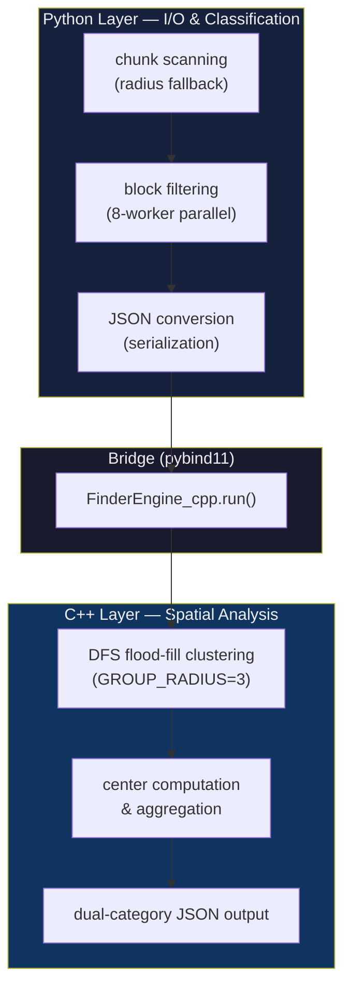
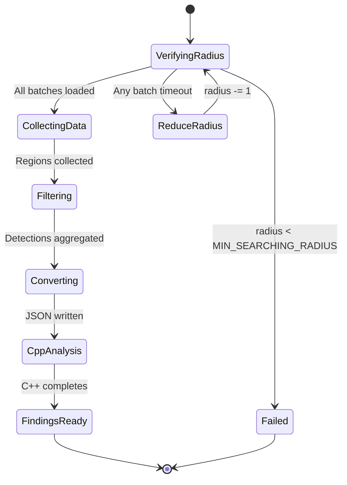
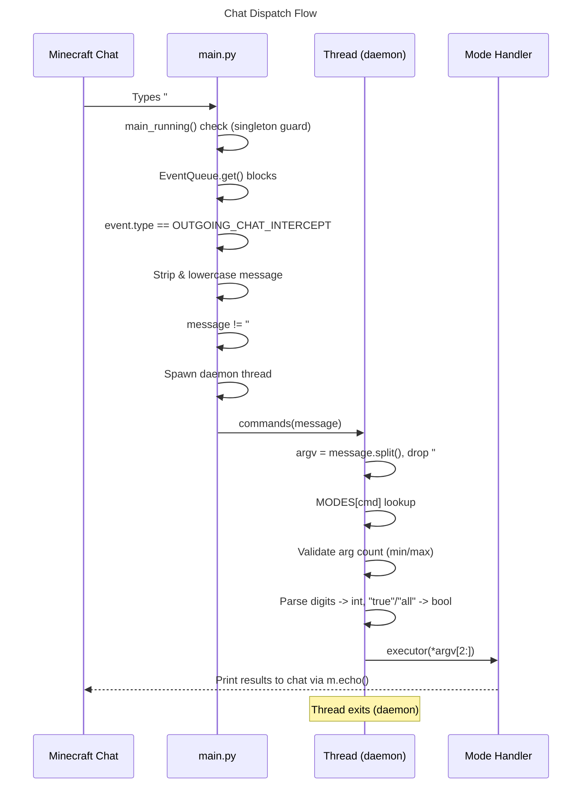
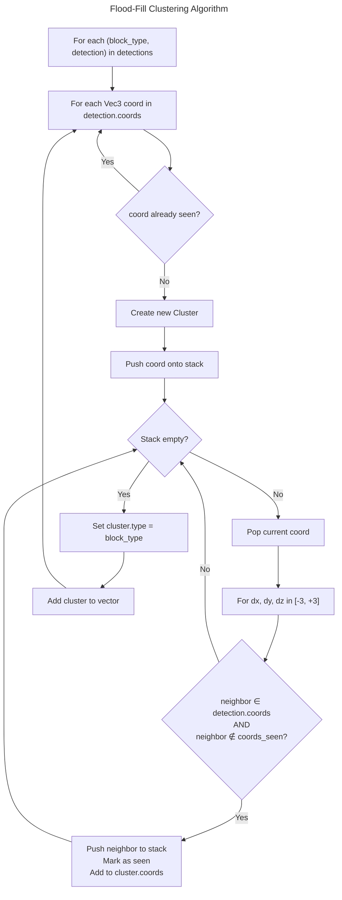
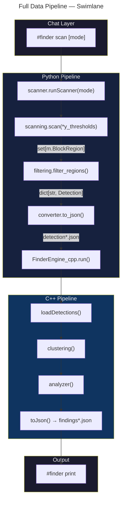
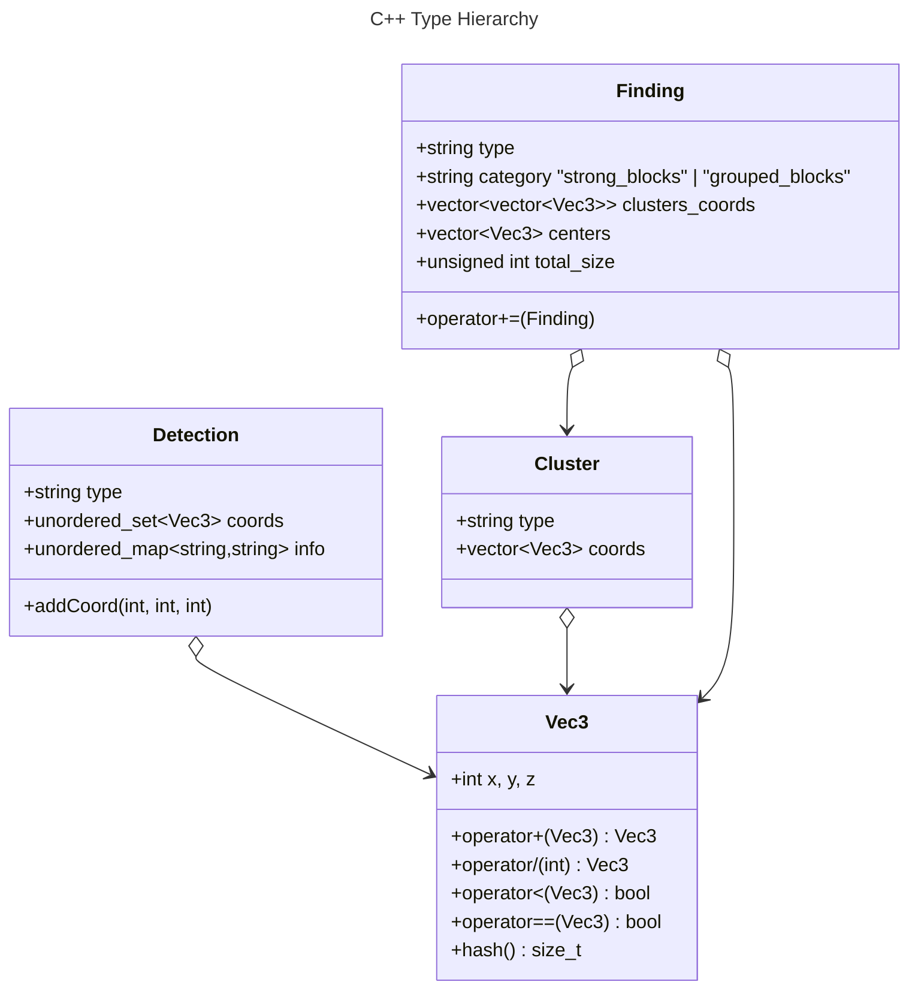
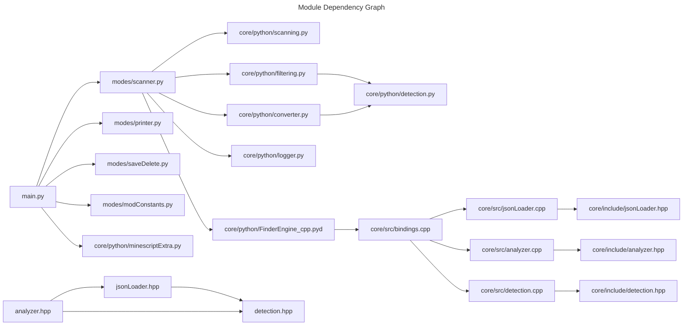
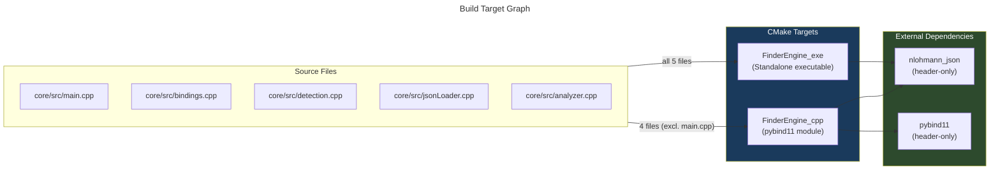
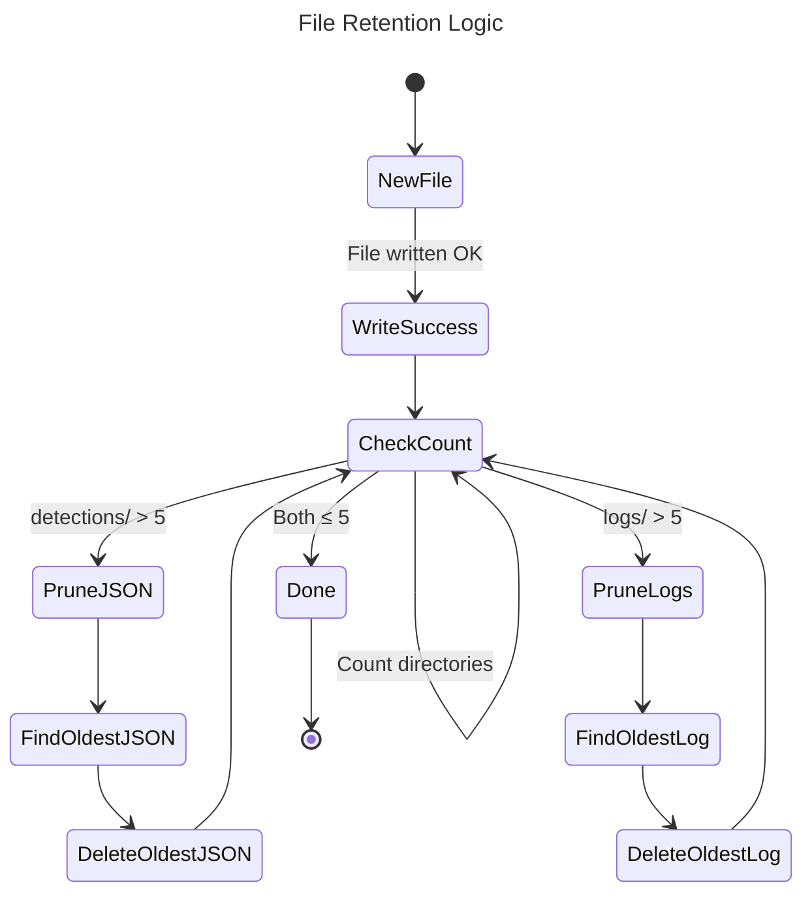

# Architecture — Minecraft Base Finder Engine

> **Audience:** Developers, contributors, and engineers who need to understand, modify, or extend the engine.  
> **Prerequisites:** Familiarity with Python, C++20, CMake, and the Minescript API.

---

## Table of Contents

1. [System Overview](#system-overview)
2. [System Architecture](#system-architecture)
3. [Repository Layout](#repository-layout)
4. [Entry Point & Command Dispatch](#entry-point--command-dispatch)
5. [Configuration Layer](#configuration-layer)
6. [Algorithmic Deep-Dive](#algorithmic-deep-dive)
7. [Scan Pipeline (Python)](#scan-pipeline-python)
8. [Analysis Pipeline (C++)](#analysis-pipeline-c)
9. [Python↔C++ Bridge](#pythonc-bridge)
10. [Build System](#build-system)
11. [Data Lifecycle & Retention](#data-lifecycle--retention)
12. [Safety & Failure Recovery](#safety--failure-recovery)
13. [Production Configuration Reference](#production-configuration-reference)
14. [Extensibility Points](#extensibility-points)
15. [Performance Notes](#performance-notes)
16. [Known Issues](#known-issues)
17. [File Cross-Reference](#file-cross-reference)

---

## System Overview

### Design Goals

| Goal | Rationale |
|------|-----------|
| **In-Game Experience** | All operations execute inside Minecraft via Minescript — no external tools, no world downloads, no API calls. |
| **Performance** | Block filtering uses parallel workers; spatial clustering runs in native C++ to handle thousands of coordinates efficiently. |
| **Fault Tolerance** | Chunk loading timeouts do not crash the engine — the scan radius shrinks gracefully. |
| **Modularity** | Each pipeline stage (scan → filter → convert → analyze → persist) is independently replaceable. |
| **Observability** | Dual-output logger writes detailed debug logs to disk while respecting a user-set verbosity in chat. |

### Two-Layer Pipeline Architecture

The engine is built on a two-layer architecture that separates Python scanning/filtering from C++ spatial analysis:



### Tech Stack

| Layer | Technology | Role |
|-------|-----------|------|
| Runtime | Minescript (Python mod API) | Chat interception, block queries, job control |
| Scanner | Python 3.11 | Chunk math, region loading, batch iteration |
| Filter | Python 3.11 + `concurrent.futures` | Parallel block classification |
| Bridge | pybind11 | Python ↔ C++ module boundary |
| Clustering | C++20 | Spatial flood-fill, aggregation, JSON output |
| Serialization | nlohmann/json | C++ JSON parsing and writing |
| Build | CMake 3.12+ | Dual-target build (exe + module) |

---

## System Architecture

### Module Interconnection

```mermaid
graph LR
    Main[main.py] --> Scanner[modes/scanner.py]
    Scanner --> Scan[core/python/scanning.py]
    Scanner --> Filter[core/python/filtering.py]
    Scanner --> Convert[core/python/converter.py]
    Convert --> Bridge[FinderEngine_cpp.pyd]
    Bridge --> Bindings[core/src/bindings.cpp]
    Bindings --> Load[src/jsonLoader.cpp]
    Bindings --> Cluster[src/analyzer.cpp:clustering()]
    Bindings --> Analyze[src/analyzer.cpp:analyzer()]
```

**Flow:** `#finder scan` → `main.py` dispatches to `scanner.py` → Python pipeline (scan → filter → convert) → pybind11 bridge → C++ pipeline (load → cluster → analyze → JSON output).

### Thread Architecture

All Python threads are daemon threads; C++ runs synchronously inside the scan daemon thread.

| Thread | Count | Role | Update Rate |
|--------|-------|------|-------------|
| Event loop | 1 | Minescript chat interceptor | blocking on `EventQueue.get()` |
| Command execution | 1 daemon per command | `runScanner`, `printList`, etc. | per command |
| Block filtering | 8 workers via `ThreadPoolExecutor` | Process `BlockRegion` instances | per scan |
| C++ analysis | 1 (blocking in daemon thread) | Synchronous call to `FinderEngine_cpp.run()` | per scan |

### Scan Mode State Machine

Each scan command triggers a deterministic state flow through the pipeline:



---

## Repository Layout

```
Minecraft-Base-Finder/
│
├── find/                               # ── ENGINE ROOT ──
│   ├── main.py                         #   Entry point: Minescript event loop
│   ├── CMakeLists.txt                  #   Build definition
│   ├── cmake-variants.yaml             #   VS Code CMake presets
│   │
│   ├── config/                         # ── CONFIGURATION LAYER ──
│   │   ├── __init__.py
│   │   ├── constants.py                #   All magic numbers & thresholds
│   │   ├── config.py                   #   Filesystem path definitions
│   │   └── setting.json                #   Runtime settings (radius, logger)
│   │
│   ├── core/                           # ── CORE ENGINE ──
│   │   ├── include/                    #   C++ headers
│   │   │   ├── detection.hpp           #   Vec3, Detection class
│   │   │   ├── jsonLoader.hpp          #   JSON loader + variant simplification
│   │   │   └── analyzer.hpp            #   Cluster, Finding, algorithm declarations
│   │   │
│   │   ├── src/                        #   C++ source files
│   │   │   ├── detection.cpp           #   Vec3 operators, Detection methods
│   │   │   ├── jsonLoader.cpp          #   Variant mapping & file loading
│   │   │   ├── analyzer.cpp            #   Clustering, aggregation, JSON output
│   │   │   ├── bindings.cpp            #   pybind11 Python module entry
│   │   │   └── main.cpp                #   Standalone C++ executable entry point
│   │   │
│   │   └── python/                     #   Python layer
│   │       ├── __init__.py
│   │       ├── scanning.py             #   Chunk scanning with radius fallback
│   │       ├── filtering.py            #   Parallel block filtering
│   │       ├── detection.py            #   Python Detection data class
│   │       ├── converter.py            #   Python → JSON serialization
│   │       ├── logger.py               #   Dual-output logger
│   │       └── minescriptExtra.py      #   Chat colors, job kill, help text
│   │
│   ├── modes/                          # ── COMMAND HANDLERS ──
│   │   ├── __init__.py
│   │   ├── scanner.py                  #   Scan orchestration (calls all phases)
│   │   ├── printer.py                  #   Print findings to Minecraft chat
│   │   ├── saveDelete.py               #   Save / remove custom findings
│   │   └── modConstants.py             #   Runtime radius & logger toggles
│   │
│   ├── data/                           # ── RUNTIME DATA (gitignored) ──
│   │   ├── detections/                 #   Raw block detection JSON files
│   │   ├── findings/                   #   Processed findings JSON files
│   │   ├── findings_saved/             #   User-named saved findings
│   │   └── logs/                       #   Engine log files
│   │
│   ├── external/                       # ── THIRD-PARTY ──
│   │   ├── nlohmann_json/              #   JSON for Modern C++ (header-only)
│   │   └── pybind11/                   #   Python-C++ binding library
│   │
│   ├── build/                          # ── BUILD OUTPUT (generated) ──
│   └── test/                           # ── UNIT TESTS ──
│       ├── test.py
│       └── chunk_test.py
│
├── build/                              # Root-level build output (generated)
├── .gitignore
├── .gitmodules
├── LICENSE
└── README.md
```

---

## Entry Point & Command Dispatch

### Event Loop (`find/main.py`)

The entry point is a Minescript script that registers an outgoing chat interceptor:



### MODES Dispatch Table

Defined as a dict mapping command names to `(function, min_args, max_args)`:

| Key | Function | Min | Max | Description |
|-----|----------|-----|-----|-------------|
| `"scan"` | `scanner.runScanner` | 0 | 1 | Scan with optional mode string |
| `"print"` | `printer.printList` | 0 | 3 | Display findings |
| `"save"` | `saveDelete.save` | 1 | 2 | Save finding with name |
| `"remove"` | `saveDelete.remove` | 1 | 1 | Delete saved finding |
| `"saved"` | `printer.printSavedDIR` | 0 | 0 | List saved findings |
| `"radius"` | `modConstants.changeRadius` | 1 | 1 | Set scan radius |
| `"logger"` | `modConstants.DebugModeLogger` | 1 | 1 | Toggle debug logging |
| `"-help"` | `minescriptExtra._help` | 0 | 0 | Print help text |

**Key design decisions:**
- **Daemon threads** — each command runs in a detached thread so long-running scans do not block the event loop
- **Singleton guard** — `main_running()` prevents multiple engine instances
- **Argument coercion** — string args are converted to `int` or `bool` before dispatch
- **Stop mechanism** — `"#finder stop"` sets a flag that exits the loop; the daemon threads are allowed to finish naturally

---

## Configuration Layer

### `config/constants.py` — Magic Numbers

All tunable constants are centralized in one file:

```python
## Timing
ONE_TIME_TICK = 0.05                # 1 game tick = 50ms
MAX_TIME_AWAITING_REGION = 2        # seconds

## Chunks
CHUNK_SIZE = 8                      # blocks per chunk dimension
BATCH_SIZE = 4                      # chunks per batch (improves loading)
MAX_SEARCHING_RADIUS = 32           # blocks (max safe limit)
MIN_SEARCHING_RADIUS = 4            # blocks (minimum useful)

## Y-Level Thresholds
MAX_Y_LEVEL = 315
MIN_Y_LEVEL = -64
Y_LEVEL_SEARCHING_SKY_TH = (308, 315)
Y_LEVEL_SEARCHING_SURFACE_TH = (10, 100)
Y_LEVEL_SEARCHING_UNDERGROUND_TH = (-60, -10)

## Data Management
MAX_DETECTIONS = 5                  # retention count
```

### `config/config.py` — Path Definitions

```python
DIR_FINDINGS        # find/data/findings/
DIR_SAVED_FINDINGS  # find/data/findings_saved/
DIR_DETECTIONS      # find/data/detections/
DIR_LOGS            # find/data/logs/
SETTING_PATH        # find/config/setting.json
```

All paths are derived from `BASE_DIR` which is `find/`. This keeps the engine relocatable — copy the `find/` folder into any Minescript directory and paths resolve correctly.

### `config/setting.json` — Runtime State

```json
{
    "searching_radius": 32,
    "logger_level": "warn"
}
```

Modified at runtime via `#finder radius` and `#finder logger`. Read on every scan to allow live configuration changes without restarting.

---

## Algorithmic Deep-Dive

This section extracts and elevates the core algorithms powering each pipeline stage. For the full pipeline walkthrough with pseudocode, see [Scan Pipeline (Python)](#scan-pipeline-python) and [Analysis Pipeline (C++)](#analysis-pipeline-c).

### 6.1 Chunk Batching & Radius Fallback

**File:** `core/python/scanning.py`

The scan algorithm uses a two-pass approach: a fast verification pass loads chunks without block data, then a data pass collects blocks. This avoids partial data on timeout.

**Batch math:**
- Each batch spans `CHUNK_SIZE × BATCH_SIZE = 8 × 4 = 32` blocks in both X and Z dimensions
- A full radius-32 scan covers 64×64 chunks = 4096 chunks total
- Divided into `(64/4) × (64/4) = 16 × 16 = 256` batches

**Timeout model:**
- Per-batch timeout = `ONE_TIME_TICK × MAX_TIME_AWAITING_REGION = 0.05s × 2 = 0.1s`
- Worst-case total = 256 batches × 0.1s = ~25.6 seconds
- If any single batch times out, the entire radius is discarded and radius decrements by 1

**Fallback:**
```
for radius from setting.searching_radius down to MIN_SEARCHING_RADIUS:
    compute chunk bounds
    if dry-run verification passes for all batches:
        collect all block data
        return block regions
    radius -= 1
return empty set
```

This gracefully handles world borders, ungenerated terrain, and server lag.

### 6.2 Parallel Block Filtering

**File:** `core/python/filtering.py`

**84 block types** are organized into **9 categories** that matter for base detection:

| Category | Examples | Count |
|----------|----------|-------|
| **Functional** | furnace, crafting_table, enchanting_table, beacon, anvil, brewing_stand, jukebox | ~20 |
| **Shelves** | oak/spruce/birch/... shelf (all wood types) | 10 |
| **Signs** | oak/spruce/birch/... sign + wall_sign (all wood types) | 20 |
| **Storage** | chest, barrel, ender_chest, shulker_box (16 colors) | 19 |
| **Beds** | white/red/blue/... bed (16 colors) | 16 |
| **Lighting** | torch, glowstone, sea_lantern, end_rod, redstone_torch | ~8 |
| **Redstone** | redstone_wire, repeater, comparator, piston, observer, dispenser, dropper | ~14 |
| **Decorative** | glass (18 tints), glass_pane (16 tints), carpet (16 tints), trapdoor (12 types) | ~62 |
| **Rare** | nether_portal, dragon_egg, dragon_head | 3 |

Note: There is overlap — glass, glass_pane, carpet, and trapdoor blocks include many variants, but they all collapse into base types during C++ analysis.

**Parallel execution pattern:**
```python
with ThreadPoolExecutor(max_workers=8) as executor:
    futures = [executor.submit(process_region, region) for region in block_regions]
    for future in as_completed(futures):
        local = future.result()
        for block_type, detection in local.items():
            detection_storage[block_type] += detection
```

Each `process_region()` worker: iterates every block coordinate → calls `region.get_block(bx, by, bz)` → normalizes block name via `remove_prefix_subfix()` (strips `minecraft:` prefix and `[waterlogged=true]` suffixes) → filters against `INTERESTING_BLOCKS` set → merges same-type detections via `Detection.__iadd__()` (union of coordinate sets).

### 6.3 Variant Simplification

**File:** `core/src/jsonLoader.cpp`

The C++ loader collapses ~130 specific block variant names into **9 base types** for cleaner clustering:

| Base Type | Example Variants |
|-----------|-----------------|
| `sign` | oak_sign, spruce_wall_sign, crimson_sign, dark_oak_wall_sign |
| `bed` | white_bed, red_bed, blue_bed, green_bed (all 16 colors) |
| `glass` | glass, white_stained_glass, tinted_glass (all 16 tints) |
| `glass_pane` | glass_pane, white_stained_glass_pane (all 16 tints) |
| `carpet` | white_carpet, red_carpet, blue_carpet (all 16 colors) |
| `shulker_box` | shulker_box, black_shulker_box, pink_shulker_box (all 16 colors) |
| `anvil` | anvil, chipped_anvil, damaged_anvil |
| `trapdoor` | oak_trapdoor, iron_trapdoor, warped_trapdoor (all wood types + iron) |
| `wool` | white_wool, red_wool, blue_wool (all 16 colors) |

Variants are stored in `blocks_variants` (unordered_set of ~130 strings) and base types in `blocks_simplified` (unordered_set of 9 strings). Any block not in `blocks_variants` passes through unchanged.

### 6.4 DFS Flood-Fill Clustering

**File:** `core/src/analyzer.cpp` — `clustering()`

The spatial clustering algorithm uses a depth-first search with explicit stack to group nearby blocks of the same type:

- **`GROUP_RADIUS = 3`** — two blocks are considered connected if they are within 3 blocks of each other on any axis (a 7×7×7 = 343-block search window per step)
- **26-neighbor connectivity** — all axis-aligned and diagonal neighbors within the group radius
- **DFS with explicit stack** — avoids recursion depth issues on dense clusters
- **`coords_seen`** — global unordered_set prevents reprocessing across block types and within the same type



**Output:** `vector<Cluster>` where each cluster has a type and a list of coordinates forming one connected component.

### 6.5 Finding Aggregation

**File:** `core/src/analyzer.cpp` — `analyzer()`

Raw clusters are converted into structured `Finding` objects:

**Center computation** — arithmetic mean of all cluster coordinates:
```cpp
Vec3 center_coord(const vector<Vec3>& coords) {
    return {
        sum(x) / n,
        sum(y) / n,
        sum(z) / n
    };
}
```

**Strong block classification:**

```cpp
const unordered_set<string> STRONG_BLOCKS = {
    "beacon", "enchanting_table", "ender_chest",
    "nether_portal", "shulker_box", "barrel",
    "nether_wart", "soul_sand", "glowstone",
    "redstone_wire", "redstone_block", "repeater",
    "comparator", "dispenser", "dropper",
    "brewing_stand"
};
```

These 16 block types are tagged with `category = "strong_blocks"`. If a block type has some clusters that are strong and some that are not, the merged finding is promoted to `"strong_blocks"` (see `Finding::operator+=`).

**Findings merging via `operator+=`:**
- `clusters_coords` — appended as separate sub-lists
- `centers` — each cluster center appended independently
- `total_size` — summed across all clusters
- `category` — promoted to `"strong_blocks"` if any cluster qualifies

### 6.6 Dual-Category JSON Output

**File:** `core/src/analyzer.cpp` — `toJson()`

Findings are serialized into two categories:

```json
{
    "strong_blocks": [
        {
            "type": "beacon",
            "category": "strong_blocks",
            "clusters_coords": [[[120, 65, -340], [121, 65, -340]]],
            "centers": [{"x": 120, "y": 65, "z": -340}],
            "total_size": 2
        }
    ],
    "grouped_blocks": [
        {
            "type": "bed",
            "category": "grouped_blocks",
            "clusters_coords": [
                [[118, 64, -338], [119, 64, -338]],
                [[130, 64, -350]]
            ],
            "centers": [{"x": 118, "y": 64, "z": -338}, {"x": 130, "y": 64, "z": -350}],
            "total_size": 3
        }
    ]
}
```

- **`strong_blocks`**: High-significance block types (beacon, enchanting table, ender chest, etc.) — designed for immediate visibility
- **`grouped_blocks`**: All other detected blocks organized by cluster
- **Retention**: At most 5 findings files are kept; oldest are deleted on new write

The output file is written to `<minecraft_dir>/minescript/find/data/findings/findings_{timestamp}.json`.

---

## Scan Pipeline (Python)

### Full Pipeline Visualization



### Stage 1: `scanning.scan(*y_levels)`

**Purpose:** Load chunks around the player within the configured radius and return raw `BlockRegion` objects.

**Algorithm:**

```python
def scan(*y_level_thresholds) -> set[m.BlockRegion]:
    settings ← read setting.json
    player_chunk ← floor(player_position / CHUNK_SIZE)

    for radius from settings.searching_radius down to 1:
        compute chunk bounds: (start_chx, start_chz) to (end_chx, end_chz)

        # Dry-run verification pass
        for each batch of CHUNK_SIZE*BATCH_SIZE blocks:
            try:
                await_loaded_region(x_min, z_min, x_max, z_max)
                         .wait(timeout=2 ticks)
            except TimeoutError:
                failed = True; break

        if not failed:
            # Data collection pass
            for each batch and each y-level threshold:
                region = get_block_region(
                    (x_min, y_min, z_min), (x_max, y_max, z_max)
                )
                add region to set
            return set of block regions

        radius -= 1  # fallback

    return empty set  # all radii failed
```

**Key design decisions:**
- **Two-pass approach:** A fast verification pass loads chunks without block data, then a data pass collects blocks. This avoids partial data on timeout.
- **Batch iteration:** Regions are divided into `BATCH_SIZE × BATCH_SIZE` chunk groups, preventing the `await_loaded_region` call from timing out on large areas.
- **Dynamic fallback:** If any batch within a radius fails to load, the entire radius is discarded and the next smaller one is tried. This handles world borders and ungenerated terrain gracefully.
- **Timeout safety:** The timeout is `0.05 × 2 = 0.1s` per batch, so even a full radius-32 scan (64×64 chunks in 4×4 batches = 256 batches) times out in ~25s worst case.

### Stage 2: `filtering.filter_regions(block_regions)`

**Purpose:** From all scanned blocks, keep only those most relevant to base detection and aggregate them by type.

**Parallel Execution:**

```python
with ThreadPoolExecutor(max_workers=8) as executor:
    futures = [executor.submit(process_region, region) for region in block_regions]
    for future in as_completed(futures):
        local = future.result()
        for block_type, detection in local.items():
            detection_storage[block_type] += detection  # merge coords
```

- Each `BlockRegion` is processed by one worker
- `process_region` iterates every block coordinate in the region, calling `region.get_block(bx, by, bz)`
- Block names are normalized via `remove_prefix_subfix()` — strips `minecraft:` prefix and block state suffixes like `[waterlogged=true]`
- Only blocks in `INTERESTING_BLOCKS` pass through
- Detections of the same type are merged via `Detection.__iadd__()` (union of coordinate sets)

### Stage 3: `converter.to_json(detections)`

**Purpose:** Serialize the Python Detection dictionary into a JSON file that the C++ engine can consume.

```python
def to_json(detections: dict[str, Detection]):
    timestamp = now().strftime("%Y%m%d%H%M%S")
    entries = [d.to_dict() for d in detections.values()]
    # entries shape: [{"type": "beacon", "amount": 3, "coords": [(x,y,z), ...]}, ...]

    write to data/detections/detection{timestamp}.json

    # Retention: keep at most MAX_DETECTIONS (5) detection files
    while len(data/detections/) > 5:
        delete oldest detection*.json

    # Also clean up old log files similarly
    while len(data/logs/) > 5:
        delete oldest run_*.log
```

**JSON output format (`detection*.json`):**

```json
[
    {
        "type": "beacon",
        "amount": 3,
        "coords": [[120, 65, -340], [121, 65, -340], [122, 65, -340]]
    },
    {
        "type": "bed",
        "amount": 4,
        "coords": [[118, 64, -338], [119, 64, -338], ...]
    }
]
```

---

## Analysis Pipeline (C++)

### Core Data Types



### Stage 4: `jsonLoader.loadDetections(path)`

**Purpose:** Read a `detection*.json` file from disk and parse it into C++ `Detection` objects.

**Variant Simplification:**

The loader collapses block variants into their base type for cleaner clustering. For example:
- `oak_sign`, `spruce_wall_sign`, `crimson_sign` → `sign`
- `white_bed`, `red_bed`, `blue_bed` → `bed`
- `glass`, `white_stained_glass`, `tinted_glass` → `glass`
- `shulker_box`, `black_shulker_box`, `pink_shulker_box` → `shulker_box`
- `anvil`, `chipped_anvil`, `damaged_anvil` → `anvil`
- `oak_trapdoor`, `iron_trapdoor`, `warped_trapdoor` → `trapdoor`

```cpp
unordered_map<string, Detection> loadDetections(const string& path) {
    // Open JSON file
    // For each detection entry:
    //   block_type = variant_simplified(entry["type"])
    //   For each coordinate triple:
    //     detection.addCoord(x, y, z)
    //   Insert into map<type, Detection> (variants merge into base type)
}
```

The variant set contains ~130 specific block names that map to 9 base types. Any block not in the set passes through unchanged.

### Stage 5: `analyzer.clustering(detections)`

**Purpose:** Group spatially nearby blocks of the same type into connected clusters.

**Algorithm details:**
- **GROUP_RADIUS = 3** — two blocks are considered connected if they are within 3 blocks of each other on any axis (a 7×7×7 = 343-block search window per step)
- **26-neighbor connectivity** — all axis-aligned and diagonal neighbors within the group radius
- **DFS with explicit stack** — avoids recursion depth issues on dense clusters
- **`coords_seen`** — global unordered_set prevents reprocessing across block types and within the same type

See [Section 6.4 — DFS Flood-Fill Clustering](#64-dfs-flood-fill-clustering) for the full algorithm flowchart and details.

### Stage 6: `analyzer.analyzer(clusters, minecraft_dir)`

**Purpose:** Convert raw clusters into structured `Finding` objects with metadata.

**Strong Blocks Classification:**

```cpp
const unordered_set<string> STRONG_BLOCKS = {
    "beacon", "enchanting_table", "ender_chest",
    "nether_portal", "shulker_box", "barrel",
    "nether_wart", "soul_sand", "glowstone",
    "redstone_wire", "redstone_block", "repeater",
    "comparator", "dispenser", "dropper",
    "brewing_stand"
};
```

These 16 block types are tagged with `category = "strong_blocks"` and appear in a separate section of the output JSON. If a block type has some clusters that are strong and some that are not, the merged finding is promoted to `"strong_blocks"` (see `Finding::operator+=`).

**Center Computation:**

```cpp
Vec3 center_coord(const vector<Vec3>& coords) {
    // Arithmetic mean of all coordinates in the cluster
    return {
        sum(x) / n,
        sum(y) / n,
        sum(z) / n
    };
}
```

**Findings Merging:**

When multiple clusters of the same block type exist, they are merged via `Finding::operator+=`:
- `clusters_coords` — appended as separate sub-lists
- `centers` — each cluster center appended independently
- `total_size` — summed across all clusters
- `category` — promoted to `"strong_blocks"` if any cluster qualifies

### Stage 7: `toJson(blocks, minecraft_dir)`

**Purpose:** Serialize the final findings and write to disk.

```cpp
void toJson(const unordered_map<string, Finding>& blocks, const string& minecraft_dir) {
    json data = {
        {"strong_blocks", json::array()},
        {"grouped_blocks", json::array()}
    };

    // Separate by category
    for (auto& [type, block] : blocks) {
        data[block.category].push_back(block);
    }

    // Write to: <minecraft_dir>/minescript/find/data/findings/findings_{timestamp}.json
    // Retention: keep at most 5 findings files
}
```

**Output JSON shape (`findings*.json`):**

```json
{
    "strong_blocks": [
        {
            "type": "beacon",
            "category": "strong_blocks",
            "clusters_coords": [[[120, 65, -340], [121, 65, -340]]],
            "centers": [{"x": 120, "y": 65, "z": -340}],
            "total_size": 2
        }
    ],
    "grouped_blocks": [
        {
            "type": "bed",
            "category": "grouped_blocks",
            "clusters_coords": [
                [[118, 64, -338], [119, 64, -338]],
                [[130, 64, -350]]
            ],
            "centers": [{"x": 118, "y": 64, "z": -338}, {"x": 130, "y": 64, "z": -350}],
            "total_size": 3
        }
    ]
}
```

---

## Python↔C++ Bridge

### `bindings.cpp` — pybind11 Module

The bridge exposes a single function to Python:

```cpp
void start_analysis(const std::string& minecraft_dir) {
    path DIR_DETECTIONS = minecraft_dir / "minescript" / "find" / "data" / "detections";

    auto files = sorted_files_in_dir(DIR_DETECTIONS);
    path detection_path = DIR_DETECTIONS / files.back();  // latest file

    auto detections = loadDetections(detection_path.string());
    auto clusters = clustering(detections);
    analyzer(clusters, minecraft_dir);
}

PYBIND11_MODULE(FinderEngine_cpp, m) {
    m.def("run", &start_analysis, py::arg("minecraft_dir"),
          "Runs full C++ clustering and analysis pipeline");
}
```

**How it works:**

1. `scanner.py` calls `FinderEngine_cpp.run(os.getcwd())` after the converter writes the `detection*.json`
2. `minecraft_dir` is the current working directory (Minecraft's run directory), which contains the `.minecraft/minescript/find/data/detections/` subpath
3. C++ picks the newest detection file via `sorted_files_in_dir()` (sorted alphabetically — timestamps are ISO format, so sort = chronological)
4. All exceptions (`runtime_error` for missing directory or no files) propagate to Python via pybind11's exception translation

### Module Dependency Graph



---

## Build System

### CMake Targets



### `CMakeLists.txt`

```cmake
cmake_minimum_required(VERSION 3.12)
set(CMAKE_CXX_STANDARD 20)
set(CMAKE_CXX_STANDARD_REQUIRED ON)
project(FinderEngine LANGUAGES CXX)

# MSVC: /MD → /MT (static runtime)
if(MSVC)
    add_compile_options(/D_CRT_SECURE_NO_WARNINGS)
    # ... regex replacement of /MD with /MT in CMAKE_CXX_FLAGS_*
endif()

# External dependencies
add_subdirectory(external/nlohmann_json)
add_subdirectory(external/pybind11)

# Target 1: Standalone executable (for testing)
add_executable(FinderEngine_exe
    core/src/main.cpp
    core/src/detection.cpp
    core/src/jsonLoader.cpp
    core/src/analyzer.cpp
)
target_link_libraries(FinderEngine_exe PRIVATE nlohmann_json::nlohmann_json)

# Target 2: Python module
pybind11_add_module(FinderEngine_cpp
    core/src/bindings.cpp
    core/src/detection.cpp
    core/src/jsonLoader.cpp
    core/src/analyzer.cpp
)
target_link_libraries(FinderEngine_cpp PRIVATE
    nlohmann_json::nlohmann_json
    pybind11::pybind11
)

# Unix: link stdc++fs and static link flags
if(NOT MSVC)
    target_link_libraries(FinderEngine_exe PRIVATE stdc++fs)
    target_link_libraries(FinderEngine_cpp PRIVATE stdc++fs)
    set_target_properties(FinderEngine_cpp PROPERTIES
        LINK_FLAGS "-static -static-libgcc -static-libstdc++"
    )
endif()
```

**Key points:**
- **Dual target** — the standalone executable `FinderEngine_exe` is useful for testing the C++ pipeline in isolation; the pybind11 module `FinderEngine_cpp` is the production interface
- **`main.cpp` exclusion** — only `bindings.cpp` has a `PYBIND11_MODULE` macro, and `main.cpp` has a regular `int main()`, so they cannot coexist in the same target
- **Static linking** — MSVC uses `/MT` to avoid runtime DLL dependencies; Unix static links `libgcc` and `libstdc++` for portability
- **`stdc++fs`** — required on older GCC for `std::filesystem` (redundant on GCC 12+ but kept for compatibility)

---

## Data Lifecycle & Retention

### File Naming Convention

| File | Pattern | Example |
|------|---------|---------|
| Detection | `detection{YYYYMMDDHHMMSS}.json` | `detection20250608175500.json` |
| Findings | `findings_{YYYYMMDDHHMMSS}.json` | `findings_20250608175500.json` |
| Log | `run_{YYYYMMDDHHMMSS}.log` | `run_20250608175500.log` |

ISO 8601 numeric timestamps enable alphabetical sorting to equal chronological ordering.

### Directory Structure

```
find/data/
├── detections/         # Python writes → C++ reads
│   ├── detection20250608175500.json
│   ├── detection20250608175600.json
│   └── ... (max 5)
├── findings/           # C++ writes → Python reads
│   ├── findings_20250608175500.json
│   ├── findings_20250608175600.json
│   └── ... (max 5)
├── findings_saved/     # User-persisted (no auto-cleanup)
│   ├── my_base.json
│   └── ...
└── logs/               # Python writes (debug)
    ├── run_20250608175500.log
    └── ... (max 5)
```

### Retention State Machine



**Retention rules:**
- **Detections (Python → C++):** Kept by `converter.py` — deletes oldest `detection*.json` when count exceeds `MAX_DETECTIONS` (5)
- **Findings (C++ → Python):** Kept by `analyzer.cpp` — deletes oldest `findings_*.json` when count exceeds 5
- **Logs (Python logger):** Kept by `converter.py` — same retention policy as detections
- **Saved findings:** Never auto-deleted; user-managed via `#finder remove`

---

## Safety & Failure Recovery

### Hazard Mitigation Matrix

| Hazard | Detection Method | Threshold | Response Action |
|--------|-----------------|-----------|-----------------|
| **Chunk load timeout** | `await_loaded_region` wait | 2 ticks (0.1s) per batch | Radius fallback (-1 block), retry |
| **World border / ungenerated** | Batch verification fails | Any batch fails | Discard radius, retry with smaller |
| **C++ module crash** | pybind11 `runtime_error` exception | Any C++ exception | Propagate to Python, logged; user sees error in chat |
| **File I/O error** | `ofstream` / `ifstream` `is_open()` check | File handle null | Throw `runtime_error`, caught by scanner |
| **Empty scan result** | `filter_regions()` returns empty dict | 0 interesting blocks | Write empty detection JSON; C++ throws on empty cluster set |

### Graceful Degradation

The engine employs a **radius fallback** strategy as its primary fault tolerance mechanism:

1. **Start at configured radius** (default 32). Compute chunk bounds and batch partitions.
2. **Dry-run each batch** with a 0.1s timeout. If any batch fails to load (world border, ungenerated terrain, server lag), abort the entire radius.
3. **Decrement radius by 1** and retry from step 1. This ensures the engine always uses the largest stable radius available.
4. **Hard floor at `MIN_SEARCHING_RADIUS` (4)** — below this, the scan aborts and reports failure.

**Empty scan handling:** If the filter stage produces zero interesting blocks (e.g., scanning an ocean or a void world), an empty detection JSON is still written and passed to the C++ engine. The C++ clustering stage will detect an empty detection map and throw a descriptive error, which propagates back to the user as a chat message.

---

## Production Configuration Reference

### User-Facing vs Internal Constants

| Constant | Value | Category | Description |
|----------|-------|----------|-------------|
| `MAX_SEARCHING_RADIUS` | 32 | User | Maximum scan radius around the player (blocks) |
| `MIN_SEARCHING_RADIUS` | 4 | User | Minimum useful scan radius (blocks) |
| `MAX_DETECTIONS` | 5 | User | Maximum detection/findings files retained per directory |
| `CHUNK_SIZE` | 8 | Internal | Blocks per chunk dimension |
| `BATCH_SIZE` | 4 | Internal | Chunks per batch (tradeoff: larger = fewer batches but heavier per-batch load) |
| `GROUP_RADIUS` | 3 | Internal | Spatial clustering radius — max distance between connected blocks (blocks) |
| `MAX_TIME_AWAITING_REGION` | 2 | Internal | Region load timeout (game ticks; 0.1s at 20 TPS) |
| `ONE_TIME_TICK` | 0.05 | Internal | Duration of one game tick (seconds) |

### Y-Level Thresholds

| Constant | Value | Mode |
|----------|-------|------|
| `Y_LEVEL_SEARCHING_SKY_TH` | (308, 315) | Sky |
| `Y_LEVEL_SEARCHING_SURFACE_TH` | (10, 100) | Surface |
| `Y_LEVEL_SEARCHING_UNDERGROUND_TH` | (-60, -10) | Underground |

### Block Taxonomy Reference

The engine monitors **84 block types** across **9 categories**:

| Category | Examples | Count | Why It Matters |
|----------|----------|-------|----------------|
| **Functional** | furnace, crafting_table, enchanting_table, beacon, anvil, brewing_stand, jukebox | ~20 | Core player activity markers |
| **Shelves** | oak/spruce/birch/... shelf (all wood types) | 10 | Storage + organization indicators |
| **Signs** | oak/spruce/birch/... sign + wall_sign | 20 | Player labeling / territory marking |
| **Storage** | chest, barrel, ender_chest, shulker_box (16 colors) | 19 | Primary base storage |
| **Beds** | white/red/blue/... bed (16 colors) | 16 | Player spawn + sleep location |
| **Lighting** | torch, glowstone, sea_lantern, end_rod, redstone_torch | ~8 | Mob-proofing, path marking |
| **Redstone** | redstone_wire, repeater, comparator, piston, observer, dispenser, dropper | ~14 | Automation / technical base markers |
| **Decorative** | glass (18 tints), glass_pane (16 tints), carpet (16 tints), trapdoor (12 types) | ~62 | Build refinement / aesthetic effort |
| **Rare** | nether_portal, dragon_egg, dragon_head | 3 | End-game / high-value indicators |

### Variant Mapping Reference

| Base Type | Example Variants |
|-----------|-----------------|
| `sign` | oak_sign, spruce_wall_sign, crimson_sign, dark_oak_wall_sign, ... (10 wood types × 2 forms) |
| `bed` | white_bed, red_bed, blue_bed, green_bed, ... (16 colors) |
| `glass` | glass, white_stained_glass, tinted_glass, ... (16 tints + base) |
| `glass_pane` | glass_pane, white_stained_glass_pane, ... (16 tints + base) |
| `carpet` | white_carpet, red_carpet, blue_carpet, ... (16 colors) |
| `shulker_box` | shulker_box, black_shulker_box, pink_shulker_box, ... (16 colors) |
| `anvil` | anvil, chipped_anvil, damaged_anvil |
| `trapdoor` | oak_trapdoor, iron_trapdoor, warped_trapdoor, ... (12 types) |
| `wool` | white_wool, red_wool, blue_wool, ... (16 colors) |

---

## Extensibility Points

### 1. Adding New Interesting Block Types

**File:** `core/python/filtering.py` — `INTERESTING_BLOCKS` set

Simply add the Minecraft block ID string (without `minecraft:` prefix) to the set. If it has colored/wood variants that should be collapsed, also update:

**File:** `core/src/jsonLoader.cpp` — `blocks_variants` and `blocks_simplified`

Add the variant names to `blocks_variants` and the base name to `blocks_simplified` (if not already present).

### 2. Adding New Strong Blocks

**File:** `core/src/analyzer.cpp` — `STRONG_BLOCKS` set

Add the block type (as it appears after variant simplification) to this set. It will automatically appear in the `"strong_blocks"` output category.

### 3. Adding New Scan Modes

**File:** `find/config/constants.py` — define new Y-level threshold tuple  
**File:** `find/modes/scanner.py` — add new `elif` branch in `runScanner()`

```python
elif mode == "nether":
    args = (Y_LEVEL_SEARCHING_NETHER_TH,)
```

### 4. Adding New Commands

1. Write the handler function in an existing or new `modes/` file
2. Register it in `find/main.py` — `MODES` dispatch table

```python
MODES = {
    ...
    "mycommand": (my_handler, min_args, max_args),
}
```

### 5. Customizing Output Format

**File:** `find/modes/printer.py` — `printList()` controls all chat output

### 6. Changing Clustering Parameters

**File:** `core/src/analyzer.cpp` — `GROUP_RADIUS` constant (line 7)

Increasing `GROUP_RADIUS` merges more distant blocks into the same cluster; decreasing makes clusters more granular.

### 7. Adding Logger Sinks

**File:** `core/python/logger.py` — `setup_logger()`

The existing pattern (file + stream handlers) can be extended to add email, webhook, or in-game HUD outputs.

---

## Performance Notes

| Component | Profile | Bottleneck | Mitigation |
|-----------|---------|------------|------------|
| `scanning.scan()` | I/O-bound | `await_loaded_region` timeout | Batch partitioning; fallback radius |
| `process_region()` | CPU-bound | Triple-nested loop over block coords | Parallel `ThreadPoolExecutor(8)` |
| `filter_regions()` | CPU-bound | `region.get_block()` per coordinate | Already parallelized; ~30-60k blocks/s on 8 cores |
| `loadDetections()` | I/O+CPU | JSON parsing | Single file read; nlohmann is memory-mapped |
| `clustering()` | CPU-bound | DFS flood-fill (worst case O(n²)) | Unordered_set lookups are O(1) avg; n < 5000 typical |
| `toJson()` | I/O-bound | Filesystem write | Single write; ~1-5ms |

### Memory Bounds

- **Radius 32:** 64×64 chunks = 4096 chunks = ~260,000 block positions scanned (across 3 Y-level bands for `full` mode)
- **Interesting blocks found:** Typically 50–500 per scan on a moderately built world
- **Detection JSON size:** 5–50 KB
- **Findings JSON size:** 1–10 KB
- **C++ memory:** Negligible (< 10 MB heap)

---

## Known Issues

The following issues were identified during a formal code review on 2026-06-08. They are documented here for transparency and prioritization.

### Critical

| ID | File | Issue | Status |
|----|------|-------|--------|
| #1 | `find/main.py:32` | Cross-platform path separator in singleton guard — hardcoded `find\\main` (backslash) fails on Linux/macOS, allowing duplicate engine instances | Open |

### Medium

| ID | File | Issue | Status |
|----|------|-------|--------|
| #2 | `find/core/src/detection.cpp:9-11` | `Vec3::operator/` uses compound assignment (`x /= n`) inside initializer list, mutating the operand — a side-effect bug that breaks `operator/` contract | Open |
| #3 | `find/core/python/filtering.py:43` | Typo `"whiter_skeleton_skull"` instead of `"wither_skeleton_skull"` — wither skeleton skulls are never detected | Open |
| #4 | Multiple files | Import path inconsistency — 8 files use `find.` prefix, 3 use bare imports; fragile resolution | Open |
| #5 | `find/modes/scanner.py:13` | `runScanner()` lacks exception handling — daemon thread silently swallows all errors, user sees no feedback | Open |

### Low

| ID | File | Issue | Status |
|----|------|-------|--------|
| #6 | `find/core/src/main.cpp:11` | Standalone executable hardcodes `%APPDATA%` (Windows-only); fails on Linux/macOS | Open |
| #7 | `find/core/src/analyzer.cpp:178` | Variable shadowing — inner loop variable `cluster` shadows outer `Cluster` variable, reducing readability | Open |
| #8 | `find/main.py:44` | No guard for bare `#finder` command — `IndexError` when user types just `#finder` with no subcommand; silent daemon failure | Open |

---

## File Cross-Reference

| File | Responsibilities | Key Exports | Depends On |
|------|-----------------|-------------|------------|
| `find/main.py` | Entry point, event loop, command dispatch | `main()`, `commands()`, `MODES` | `minescriptExtra`, all modes |
| `find/config/constants.py` | All magic numbers and thresholds | `CHUNK_SIZE`, `MAX_SEARCHING_RADIUS`, Y-level thresholds | — |
| `find/config/config.py` | Filesystem path definitions | `DIR_FINDINGS`, `DIR_DETECTIONS`, `SETTING_PATH` | — |
| `find/config/setting.json` | Runtime settings | `searching_radius`, `logger_level` | — |
| `find/core/python/scanning.py` | Chunk scanning with radius fallback | `scan()` | `minescript`, `constants`, `config` |
| `find/core/python/filtering.py` | Parallel block filtering | `filter_regions()`, `process_region()`, `INTERESTING_BLOCKS` | `minescript`, `detection`, `logger` |
| `find/core/python/detection.py` | Python Detection data class | `Detection`, `add_coords()`, `merge()` | — |
| `find/core/python/converter.py` | Python→JSON serialization | `to_json()` | `detection`, `config`, `logger` |
| `find/core/python/logger.py` | Dual-output logger | `setup_logger()`, `logger` | `config` |
| `find/core/python/minescriptExtra.py` | Chat colors, job management, help | `clr()`, `kill_jobs()`, `_help()` | `constants` |
| `find/core/include/detection.hpp` | Vec3 and Detection declarations | `Vec3`, `Detection` | `nlohmann/json` |
| `find/core/include/jsonLoader.hpp` | JSON loader declarations | `loadDetections()`, `variant_simplified()` | `detection.hpp` |
| `find/core/include/analyzer.hpp` | Cluster, Finding, algorithm declarations | `Cluster`, `Finding`, `clustering()`, `analyzer()` | `detection.hpp`, `jsonLoader.hpp` |
| `find/core/src/detection.cpp` | Vec3 operators, Detection methods | — | `detection.hpp` |
| `find/core/src/jsonLoader.cpp` | Variant normalization, JSON loading | `loadDetections()` | `jsonLoader.hpp` |
| `find/core/src/analyzer.cpp` | Clustering, aggregation, JSON output | `clustering()`, `analyzer()`, `toJson()` | `analyzer.hpp` |
| `find/core/src/bindings.cpp` | pybind11 bridge | `start_analysis()`, `FinderEngine_cpp` module | All C++ headers, pybind11 |
| `find/modes/scanner.py` | Scan orchestration | `runScanner()` | All core/python modules |
| `find/modes/printer.py` | Print findings to chat | `printList()`, `printSavedDIR()` | `config`, `minescriptExtra` |
| `find/modes/saveDelete.py` | Save/remove custom findings | `save()`, `remove()` | `config`, `minescriptExtra` |
| `find/modes/modConstants.py` | Runtime config toggles | `changeRadius()`, `DebugModeLogger()` | `config`, `constants` |
| `find/test/test.py` | General unit tests | — | All core modules |
| `find/test/chunk_test.py` | Chunk boundary tests | — | `constants` |
| `find/CMakeLists.txt` | Build definition | `FinderEngine_exe`, `FinderEngine_cpp` targets | nlohmann_json, pybind11 |

---

> This architecture document is maintained alongside the codebase. If you make structural changes, please update the relevant sections.  
> For a high-level overview, see the [project README](../README.md).
